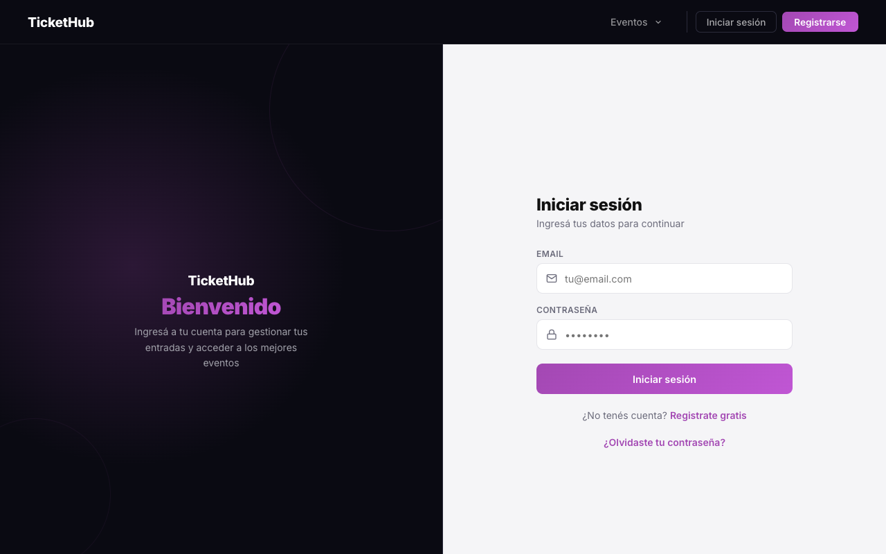
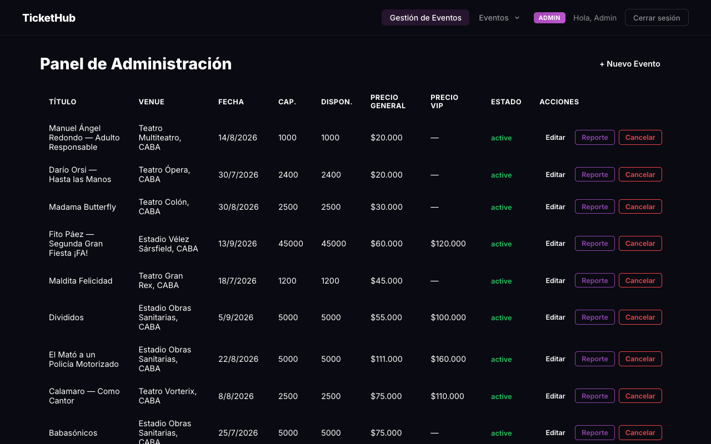
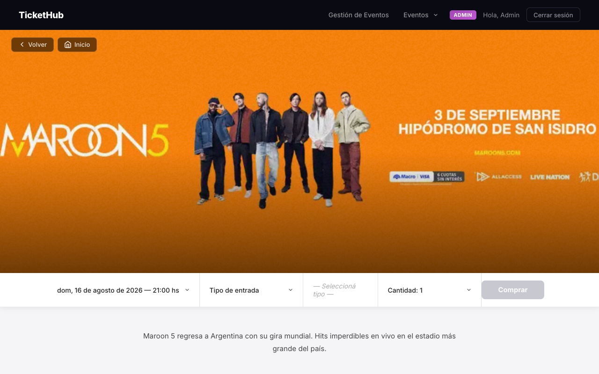
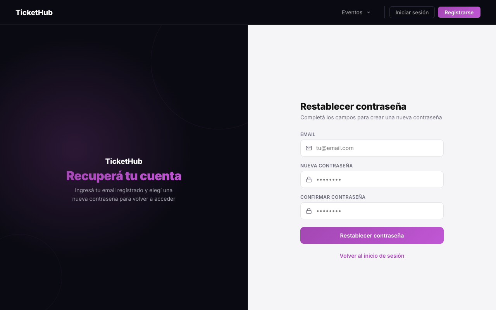

# TicketHub — Sistema de Gestión de Eventos y Entradas

Sistema tipo Ticketek desarrollado como Práctico Integrador 2026 — Desarrollo de Software, Facultad de Ingeniería UCC.

## Descripción

TicketHub permite explorar eventos, comprar entradas, cancelarlas y traspasarlas a otros usuarios. Los administradores pueden crear y gestionar eventos y ver las metricas de cada evento.

## Capturas de Pantalla

| Home — Catálogo de eventos | Inicio de sesión |
|---|---|
|  |  |

| Panel de administración | Detalle de evento |
|---|---|
|  |  |

| Restablecer contraseña |
|---|
|  |

## Tecnologías Utilizadas

| Capa | Tecnología |
|------|-----------|
| Backend | Go 1.22, Gin, GORM |
| Base de datos | MySQL 8.0 |
| ORM | GORM (con driver MySQL) |
| Autenticación | JWT (golang-jwt/jwt v5) |
| QR Code | skip2/go-qrcode |
| Frontend | React 18, Vite, React Router v6 |
| HTTP Client | Axios |
| DevOps | Docker, Docker Compose, Nginx |

## Requisitos Previos

- Go >= 1.22
- Node.js >= 20
- MySQL 8.0
- Docker y Docker Compose (opcional)

## Instalación y Uso

### Opción 1 — Docker Compose (utilizado)

```bash
git clone <url-del-repo>
cd PROYECTO\ DESARROLLO
cp backend/.env.example backend/.env   
docker-compose up --build
```

### Opción 2 — Local

#### Base de datos
```sql
CREATE DATABASE ticketek_db;
```

#### Backend
```bash
cd backend
cp .env.example .env      
go mod tidy
go run main.go
```

#### Frontend
```bash
cd frontend
npm install
npm run dev
```

### Ejecutar tests

Los tests usan **SQLite en memoria** — no requieren Docker ni ninguna base de datos externa.

Desde `backend/`:

```bash
# Correr todos los tests con detalle
go test ./tests/... -v

# Sin logs de GORM (salida más limpia)
go test ./tests/... -v 2>/dev/null

# Ver cobertura sobre servicios y controladores (objetivo: 80%)
go test ./tests/... -coverprofile=coverage.out -coverpkg=./controllers/...,./services/...
go tool cover -func=coverage.out | grep total
```

## Usuarios de Prueba

El sistema maneja dos roles: **Cliente** y **Administrador**.

- Cualquiera puede **registrarse** desde la pantalla de registro (queda con rol *cliente*).
- El **primer administrador** se crea registrando un usuario y luego promoviéndolo en la base de datos:

Credenciales de demostración sugeridas:

| Rol | Email | Password |
|-----|-------|----------|
| Administrador | `admin@demo.com` | `admin123` |
| Cliente | `cliente@demo.com` | `cliente123` |


## Decisiones de Diseño

**1. Soft delete para eventos:** En lugar de eliminar físicamente los registros de la tabla `events`, se actualiza el campo `status` a `cancelled`. Esto preserva la integridad referencial de los tickets existentes y permite auditar el historial de eventos cancelados sin perder datos.

**2. Generación del QR post-insert:** El código QR se genera con el ID del ticket recién creado como parte del string único (`TICKET-{id}-USER-{id}-EVENT-{id}`). Esto requiere un segundo `UPDATE` tras el `INSERT`, pero garantiza que el QR esté ligado al ID real de la base de datos, evitando colisiones y haciendo el código escaneable trazable al registro exacto.

**3. Nuevo QR en traspaso:** Al transferir un ticket, se genera un nuevo código QR para el nuevo titular, invalidando el anterior. Esto impide que el titular original use una copia del QR anterior tras el traspaso.

**4. Limpieza de asociaciones en el traspaso:** Al traspasar, el ticket se carga con las asociaciones precargadas (`Preload("User")`). Antes de guardar el nuevo titular, se limpian esas asociaciones para evitar que GORM reescriba la clave foránea `user_id` con el titular anterior. Este caso fue detectado y cubierto por los tests de integración.

## Bonus Track — Código QR por entrada

Cada entrada incluye un código QR único generado en el servidor, que codifica un identificador del ticket (`TICKET-{id}-USER-{id}-EVENT-{id}`). Al traspasar una entrada se genera un QR nuevo y el anterior queda inválido, de modo que el titular original no pueda reutilizarlo. El QR se almacena como campo `qr_code` en la tabla `tickets` (imagen en base64).
