# Diagrama de la Base de Datos

Modelo relacional del sistema (MySQL, mapeado con GORM). Tres entidades
principales: **User**, **Event** y **Ticket**, con sus claves foráneas.

```mermaid
erDiagram
    USER ||--o{ TICKET : "compra"
    EVENT ||--o{ TICKET : "tiene"

    USER {
        uint id PK
        string name
        string email "único"
        string password "hash SHA-256"
        string role "client | admin"
        datetime created_at
        datetime updated_at
        datetime deleted_at "soft delete"
    }

    EVENT {
        uint id PK
        string title
        string description
        datetime date
        int duration "minutos"
        string venue
        int capacity
        int available
        string category
        string image_url
        float price
        string status "active | cancelled"
        datetime created_at
        datetime updated_at
        datetime deleted_at "soft delete"
    }

    TICKET {
        uint id PK
        uint user_id FK
        uint event_id FK
        string status "active | cancelled | transferred"
        string qr_code "QR en base64 (Bonus)"
        datetime created_at
        datetime updated_at
        datetime deleted_at "soft delete"
    }
```

## Relaciones
- Un **User** puede tener muchos **Tickets** (1:N) → `ticket.user_id` referencia a `user.id`.
- Un **Event** puede tener muchos **Tickets** (1:N) → `ticket.event_id` referencia a `event.id`.

## Notas de diseño
- **Soft delete:** las tres entidades usan `deleted_at` (gorm.Model), por lo que las bajas no borran físicamente.
- **Cancelación de eventos:** se hace por estado (`status = cancelled`), no por borrado.
- **Bonus (QR):** el `qr_code` se guarda como propiedad de la entrada; en el traspaso se genera uno nuevo.
