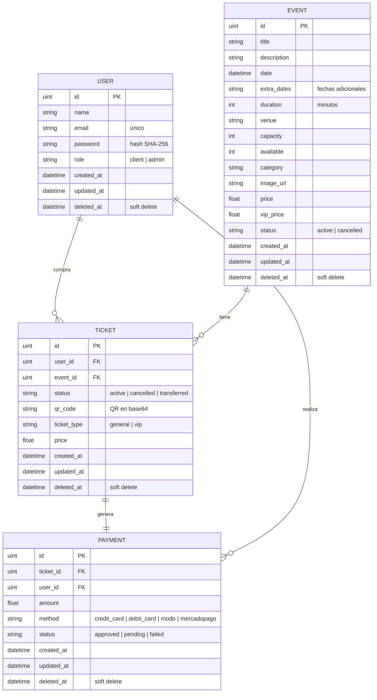

# Diagrama de la Base de Datos

Modelo relacional del sistema (MySQL, mapeado con GORM). Cuatro entidades:
**User**, **Event**, **Ticket** y **Payment**, con sus claves foráneas.

## Relaciones
- **User → Ticket** (1:N): un usuario puede tener muchos tickets. `ticket.user_id` → `user.id`
- **Event → Ticket** (1:N): un evento puede tener muchos tickets. `ticket.event_id` → `event.id`
- **Ticket → Payment** (1:1): cada ticket genera un pago. `payment.ticket_id` → `ticket.id`
- **User → Payment** (1:N): un usuario puede tener muchos pagos. `payment.user_id` → `user.id`

## Notas de diseño
- **Soft delete:** todas las entidades usan `deleted_at` (gorm.Model), las bajas no borran físicamente.
- **Cancelación de eventos:** se hace por campo `status = cancelled`, preservando los tickets existentes.
- **Traspaso:** al traspasar, el ticket original pasa a `transferred` y se crea un ticket nuevo para el destinatario con un QR nuevo.
